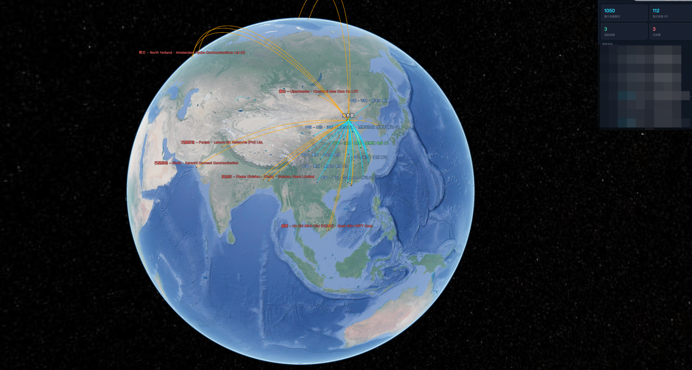
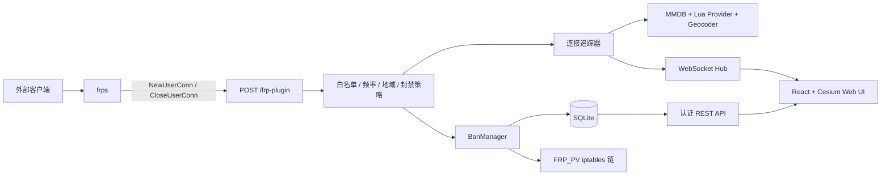

# FRP_PV

FRP_PV 是面向 [frp](https://github.com/fatedier/frp) Server Plugin 的实时连接态势感知与主动防御系统。后端使用 Go，前端使用 React、TypeScript 与 CesiumJS，配置、账户和封禁历史统一保存在 SQLite。



## 功能

- 3D 地球实时显示来源 IP、地理位置、连接路径和服务器位置
- WebSocket 推送连接、断开、封禁、解封和活跃连接变化
- 演示模式自动聚焦来源地、沿线路滚动地球，空闲时自动旋转
- URL 参数直接进入无 UI 大屏演示模式
- 多种 Cesium Ion、Google、Esri、OpenStreetMap 和 CartoDB 底图
- plugin 同步拦截与 Linux `iptables` 内核拦截两种模式
- 滑动窗口自动封禁，重复违规时按次数递增封禁时间
- 可配置最长封禁时间或永久封禁
- IP 白名单与 FRP 服务白名单
- 未知国家、完全未知位置的独立封禁开关
- SQLite 持久化设置、封禁状态与违规次数
- MMDB、Lua provider、Lua geocoder 多来源地理信息查询
- Retina/高 DPI 渲染、MSAA/FXAA 抗锯齿、清晰线芯与中文字体回退

# frps

目前项目是frp插件模式，需要一个特定版本的 frp：

[xb-bxy/frp](https://github.com/xb-bxy/frp/releases/tag/v0.68.1)

## frp中添加配置
```json
{
  [[httpPlugins]]
  name = "frp-pv"
  addr = "127.0.0.1:5508"
  path = "/frp-plugin"
  ops = ["NewUserConn", "CloseUserConn"]
}
```

## 系统架构



### 请求处理流程

1. `frps` 把 `NewUserConn` 或 `CloseUserConn` 事件发送到 `/frp-plugin`。
2. plugin 模式同步检查白名单、已有封禁、频率和地域规则，再返回允许或拒绝。
3. iptables 模式立即向 frp 返回允许，统计和自动封禁异步执行，真正的网络阻断由 `FRP_PV` 链完成。
4. 地理信息通过本地 MMDB 和 Lua provider 查询，并可通过 geocoder 补全。
5. 连接、断开和封禁事件通过 WebSocket 广播给浏览器。
6. React 状态层更新统计、日志和 Cesium 地图实体。

## 项目目录

```text
frp_PV/
├── backend/
│   ├── cmd/server/             # 程序入口、参数、路由、静态文件服务
│   └── internal/
│       ├── config/             # SQLite 设置与封禁记录
│       ├── geo/                # 地理查询、缓存、评分与多源合并
│       ├── handlers/           # 登录、API、frp plugin、WebSocket
│       ├── middleware/         # API 登录鉴权
│       ├── models/             # 数据模型与内存环形日志
│       ├── services/           # 连接追踪、封禁和 iptables
│       └── ws/                 # WebSocket 广播中心
├── frontend/
│   ├── src/components/Globe/   # Cesium 地球、底图与控制工具
│   ├── src/components/Log/     # 实时连接与系统事件
│   ├── src/components/Modal/   # 设置、防火墙、IP、Lua 等弹窗
│   ├── src/stores/             # Zustand 状态
│   └── src/pages/              # 页面组合
├── scripts/
│   ├── providers/              # Lua IP 地理信息 provider
│   ├── geocoders/              # Lua 正向/反向 geocoder
│   └── lib/                    # Lua 公共库
├── dist/                       # make 生成的部署目录
├── Makefile
└── README.md
```

## 环境要求

### 构建环境

- Go 1.22 或更高版本
- Node.js 18 或更高版本
- npm
- GNU Make

### 运行环境

- plugin 模式：Linux、macOS 等 Go 支持的平台均可
- iptables 模式：Linux，系统必须安装 `iptables`
- iptables 模式建议使用 root 运行服务
- 浏览器需要 WebGL；推荐支持 WebGL2 和硬件加速的现代浏览器
- 首次自动下载 MMDB、在线地理 provider 和在线地图需要外网访问

## FRP 版本与 plugin 配置

当前主分支使用 frp plugin 事件模式，需要支持 `NewUserConn` 和 `CloseUserConn` 的 frps。项目目前配合以下版本使用：

- [xb-bxy/frp v0.68.1](https://github.com/xb-bxy/frp/releases/tag/v0.68.1)

在 `frps.toml` 中添加：

```toml
[[httpPlugins]]
name = "frp-pv"
addr = "127.0.0.1:5508"
path = "/frp-plugin"
ops = ["NewUserConn", "CloseUserConn"]
```

如果 FRP_PV 与 frps 不在同一台机器，将 `addr` 改为 FRP_PV 的实际地址，并使用防火墙限制 `/frp-plugin` 只允许 frps 访问。

## 配置方式

项目不再读取或生成 `config.json`。旧的 `config.json` 或 `dist/config.json` 不会生效。

配置分为两类：

1. 监听与文件路径使用启动参数。
2. 业务设置在网页中修改并保存到 SQLite。

### 启动参数

```text
-db      SQLite 文件路径，默认 data/frp-pv.db
-host    HTTP 监听 IP，默认 0.0.0.0
-port    HTTP 监听端口，默认 5008
-static  前端静态文件目录，默认 static
```

示例：

```bash
./frp-pv \
  -db ./data/frp-pv.db \
  -host 0.0.0.0 \
  -port 5508 \
  -static ./static
```

当数据库位于 `部署目录/data/frp-pv.db` 时，程序会自动把部署目录作为资源根目录，并使用：

```text
部署目录/
├── data/                        # SQLite、MMDB、geo_cache.json
├── scripts/                     # Lua provider 和 geocoder
└── static/                      # 前端文件与 Cesium 静态资源
```

### 网页设置

| 设置 | 默认值 | 说明 |
|---|---:|---|
| 管理员用户名 | `root` | 登录账户 |
| 管理员密码 | 空 | 首次登录密码留空，部署后应立即修改 |
| 本国/地区 | `中国` | 境内外判断标准 |
| 防火墙模式 | `plugin` | 可切换为 `iptables` |
| 统计窗口 | 60 秒 | 自动封禁滑动窗口 |
| 触发次数 | 10 次 | 窗口内达到次数后封禁 |
| 首次封禁 | 60 分钟 | 第一次违规时长 |
| 最长封禁 | 1440 分钟 | 递增封禁上限 |
| 永久封禁 | 关闭 | 开启后新封禁不自动过期 |
| 普通地理缓存 | 7 天 | 普通 IP 缓存时间 |
| 活跃地理缓存 | 1 天 | 高频 IP 缓存时间 |
| Cesium Ion Token | 空 | Ion/Bing/Sentinel 等底图需要 |

封禁时间按照违规次数翻倍，例如 `1、2、4、8、16、24` 小时，并限制在最长封禁时间。手动解封和自然过期不会清除违规次数。

白名单 IP 无法被手动或自动封禁；白名单 FRP 服务不参与频率、地域及自动封禁规则。

## 数据存储

SQLite 默认位于 `data/frp-pv.db`，启用 WAL 模式，包含：

- `settings`：JSON 格式的系统设置、账户密码哈希和 session 密钥
- `bans`：IP、违规次数、到期时间、永久状态和封禁原因

地理缓存保存在资源目录的 `data/geo_cache.json`。连接聚合与实时事件环形日志主要保存在内存中，服务重启后重新统计。

备份时建议同时保存：

```bash
cp data/frp-pv.db data/frp-pv.db.backup
cp data/geo_cache.json data/geo_cache.json.backup
```

生产环境备份 SQLite 时，建议先停止服务，或使用 SQLite 在线备份工具，避免只复制主文件而遗漏 WAL 中尚未合并的数据。

## 编译

### 一键生成 Linux amd64 部署包

```bash
make
```

默认目标依次执行：

1. `cross`：构建 Linux amd64、静态链接的 Go 二进制
2. `frontend`：安装 npm 依赖并构建 React 前端
3. `assemble`：复制前端和 Lua 脚本到 `dist/`

产物：

```text
dist/
├── frp-pv                       # Linux amd64 二进制
├── data/
├── scripts/
└── static/
    ├── index.html
    ├── assets/
    └── cesium/
```

### 其他 Make 目标

```bash
make backend       # 构建当前操作系统/架构的后端
make frontend      # npm install + 前端生产构建
make cross         # 仅构建 Linux amd64 后端
make assemble      # 组装已有后端、前端与脚本
make dev-backend   # 开发后端，端口 5508（与 Vite 代理一致）
make dev-frontend  # Vite 开发服务器，端口 5173
make clean         # 删除 dist、前端产物和 node_modules
```

手动构建：

```bash
cd frontend
npm install
npm run build

cd ../backend
go test ./...
go build -o ../dist/frp-pv ./cmd/server
```

交叉编译其他 Linux 架构可直接调整环境变量：

```bash
cd backend
GOOS=linux GOARCH=arm64 CGO_ENABLED=0 go build -o ../dist/frp-pv-arm64 ./cmd/server
```

后端使用纯 Go SQLite 驱动，不需要系统 SQLite 或 CGO。

## 本地开发

先构建一次前端或分别启动开发服务：

```bash
# 终端 1
make dev-backend

# 终端 2
cd frontend
npm install
npm run dev
```

访问 `http://127.0.0.1:5173`。Vite 会把 `/api`、`/ws` 和 `/frp-plugin` 代理到 `127.0.0.1:5508`。

后端测试和静态检查：

```bash
cd backend
go test ./...
go vet ./...
```

前端生产检查：

```bash
cd frontend
npm run build
```

## 部署

### 直接启动

把整个 `dist/` 上传到服务器：

```bash
cd /opt/frp-pv
./frp-pv -db ./data/frp-pv.db -host 0.0.0.0 -port 5508 -static ./static
```

访问 `http://服务器IP:5508`。首次登录使用用户名 `root`，密码留空，随后立即在设置中修改密码。

### systemd

iptables 模式建议让服务以 root 运行。创建 `/etc/systemd/system/frp-pv.service`：

```ini
[Unit]
Description=FRP_PV visualization and firewall service
After=network-online.target
Wants=network-online.target

[Service]
Type=simple
User=root
WorkingDirectory=/opt/frp-pv
ExecStart=/opt/frp-pv/frp-pv -db /opt/frp-pv/data/frp-pv.db -host 0.0.0.0 -port 5508 -static /opt/frp-pv/static
Restart=on-failure
RestartSec=3
LimitNOFILE=65535

[Install]
WantedBy=multi-user.target
```

加载并启动：

```bash
sudo systemctl daemon-reload
sudo systemctl enable --now frp-pv
sudo systemctl status frp-pv
journalctl -u frp-pv -f
```

plugin 模式不需要 root，可创建专用用户，并确保其对部署目录和 SQLite 文件拥有相应权限。

### Nginx 反向代理

```nginx
server {
    listen 443 ssl http2;
    server_name pv.example.com;

    location / {
        proxy_pass http://127.0.0.1:5508;
        proxy_set_header Host $host;
        proxy_set_header X-Real-IP $remote_addr;
    }

    location /ws {
        proxy_pass http://127.0.0.1:5508;
        proxy_http_version 1.1;
        proxy_set_header Upgrade $http_upgrade;
        proxy_set_header Connection "upgrade";
        proxy_set_header Host $host;
    }
}
```

`/frp-plugin` 不应暴露给不可信网络。可以使用 Nginx、主机防火墙或安全组仅允许 frps 访问。

## 防火墙模式

| 模式 | plugin 响应 | 实际拦截位置 | 适用场景 |
|---|---|---|---|
| `plugin` | 同步判断并返回拒绝 | frps plugin | 通用部署、非 Linux |
| `iptables` | 立即返回允许 | Linux 内核 `INPUT` 链 | 高请求量、降低 plugin 延迟 |

iptables 模式只维护独立的 `FRP_PV` 链，并在 `INPUT` 顶部引用。启动和切换模式时会根据 SQLite 中仍有效的封禁记录重新同步规则；临时封禁到期后自动删除对应规则。

查看规则：

```bash
sudo iptables -L FRP_PV -n --line-numbers
sudo iptables -C INPUT -j FRP_PV
```

## 大屏演示 URL

已登录的浏览器可通过 hash 参数直接进入演示：

```text
http://服务器IP:5508/#demo=1&map=carto_dark&ui=0
```

| 参数 | 作用 |
|---|---|
| `demo=1` | 自动开启演示模式 |
| `map=名称` | 指定底图，也可使用 `imagery=名称` |
| `ui=0` | 隐藏侧栏、工具栏、状态栏和弹窗 |
| `hideui=1` | 等同于 `ui=0` |

常用底图名称：

```text
dark
carto_dark
carto_dark_nolabels
earth_at_night
google_satellite
arcgis
osm
open_topo
```

修改 hash 后立即生效，无需刷新页面。演示模式每次普通页面加载默认关闭。

演示模式连续 30 秒没有新连接时，会自动缩小到地球全景并持续旋转；任意新连接到来后立即停止空闲动画，有地理坐标的连接继续播放聚焦和连线。演示结束后再次空闲 30 秒会重复进入全景旋转。

## 地理数据与地图

- 程序启动时会扫描资源目录下的 `data/*.mmdb`
- 未找到 MMDB 时会尝试自动下载
- `scripts/providers/` 中的 Lua 脚本提供更多 IP 数据源
- `scripts/geocoders/` 用于正向或反向补全位置
- 可在网页 Lua 管理界面修改脚本并热重载
- 纯黑、OSM、CartoDB、Esri、Google 等底图依赖各自服务的网络可达性
- Cesium Ion 系列底图需要在设置中填写 Ion Token


## 安全建议

- 首次登录后立即设置管理员密码
- 使用 HTTPS 反向代理，不要直接把管理端口暴露到公网
- 限制 `/frp-plugin` 只允许 frps 访问
- 定期备份 SQLite 和自定义 Lua 脚本
- iptables 模式先在测试环境验证，避免与宿主机现有防火墙策略冲突

## 常见问题


### iptables 模式启动失败？

确认系统是 Linux、已安装 `iptables`、服务拥有 root 权限，并检查：

```bash
which iptables
sudo iptables -L INPUT -n
```

### 地图只有纯色或瓦片加载失败？

检查浏览器到地图服务的网络连接。Ion 图层还需要有效的 Cesium Ion Token；也可切换到 `dark`、`osm` 或 CartoDB 图层。

### 页面能打开但没有实时事件？

检查浏览器的 `/ws` 是否成功升级为 WebSocket，并确认 frps 的 plugin 地址、端口、路径和 `ops` 配置与 FRP_PV 一致。
